# Credit Scoring & Portfolio Loss Analysis

A quantitative credit risk project built from scratch in **C++17** and **R**, implementing statistical classifiers for loan default prediction and a Monte Carlo portfolio loss engine for Basel II risk metrics.

📄 **Full report:** [`report/Report.pdf`](report/Report.pdf)

---

## Table of Contents

- [Overview](#overview)
- [Theory](#theory)
- [Project Structure](#project-structure)
- [Experiments & Results](#experiments--results)
- [Quick Start](#quick-start)
- [Engineering Takeaways](#engineering-takeaways)
- [References](#references)

---

## Overview

| Property | Value |
|---|---|
| Dataset | Lending Club loan data (10,000 loans, 14 features, 21.2% default rate) |
| Language (ML engines) | C++17 |
| Language (analysis) | R 4.3 + ggplot2 |
| Models | LDA, k-NN (k=15), Logistic Regression (L2, mini-batch SGD) |
| Portfolio simulation | One-factor Gaussian copula, 100,000 Monte Carlo scenarios |
| Risk metrics | EL, UL, VaR 95/99%, CVaR 95/99%, Basel II IRB capital |
| LGD assumption | 45% (Basel II standard for unsecured retail) |

The project answers two questions:

1. **Borrower level** — given 14 loan features, which borrowers are likely to default?
2. **Portfolio level** — given a portfolio of loans with estimated PDs, what is the distribution of total losses and how much capital should be held?

---

## Theory

### Credit Scoring

Three classifiers are implemented from scratch in C++ (no ML libraries):

**Linear Discriminant Analysis (LDA)** — Fisher's criterion, finds the projection direction that maximises between-class separation:
```
w = Sw^{-1} (mu_1 - mu_0)
```
Decision: loan defaults if w^T x >= threshold (midpoint of projected class means).

**k-Nearest Neighbours (k=15)** — predicted PD = fraction of 15 nearest training loans (Euclidean distance, standardized features) that defaulted. Asymmetric threshold 0.35 used (false negatives are more costly than false positives in lending).

**Logistic Regression (L2)** — sigmoid model with regularised cross-entropy loss:
```
P(default | x) = 1 / (1 + exp(-(w^T x + b)))
Loss = -mean[y log(p) + (1-y) log(1-p)] + (lambda/2)||w||^2
```
Trained via mini-batch SGD (lr=0.05, lambda=1e-3, batch=64, 300 epochs).

### Portfolio Risk

**One-factor Gaussian copula** (Basel II model): each borrower shares a systematic factor Z ~ N(0,1):
```
X_i = sqrt(rho_i) * Z + sqrt(1 - rho_i) * eps_i
```
Borrower i defaults if X_i < Phi^{-1}(PD_i). Asset correlation from the Basel II IRB formula:
```
rho(PD) = 0.12 * f(PD) + 0.24 * (1 - f(PD)),   f(PD) = (1 - exp(-50*PD)) / (1 - exp(-50))
```

**Basel II Capital Requirement:**
```
K(PD) = LGD * [Phi((Phi^{-1}(PD) + sqrt(rho) * Phi^{-1}(0.999)) / sqrt(1-rho)) - PD]
```
targets the 99.9% confidence level.

Full derivations in [`report/Report.pdf`](report/Report.pdf).

---

## Project Structure

```
credit-scoring-portfolio-loss/
├── README.md
├── report/
│   ├── Report(2).pdf          # Full write-up: theory, results, Basel II analysis
│   └── report.tex          # LaTeX source
├── include/
│   ├── matrix.h            # Dense matrix, LU inversion, vector utilities
│   ├── data_loader.h       # CSV parser, feature encoding, standardization, train/test split
│   ├── classifiers.h       # LDA, k-NN, Logistic Regression, AUC/F1/precision/recall
│   ├── portfolio_mc.h      # One-factor Gaussian copula MC, Basel II formulas, VaR/CVaR
│   └── results_writer.h    # CSV export utilities
├── src/
│   └── main.cpp            # Pipeline: load -> train -> evaluate -> portfolio -> MC -> export
├── R/
│   └── analysis.R          # 12 ggplot2 visualisations
├── data/
│   └── generate_data.py    # Generates lending_club.csv (run this first)
└── results/
    └── *.png               # All 12 output plots
```

> **Note:** `data/lending_club.csv` is not committed. Run `python3 data/generate_data.py` to generate it before running the C++ model.

---

## Experiments & Results

### Exploratory Data Analysis

**Default rate increases sharply by grade — Grade G has 14x the default rate of Grade A:**

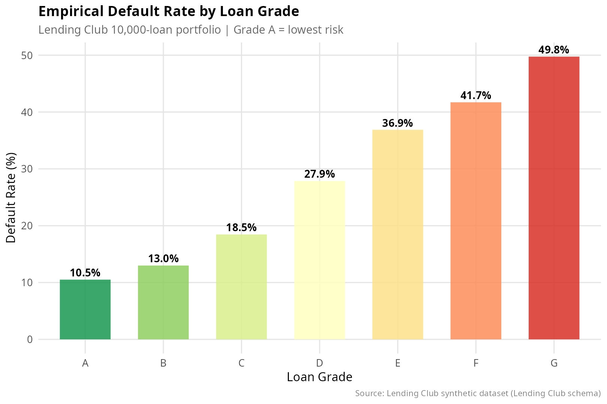

**FICO scores are strongly separated between defaulters and non-defaulters:**

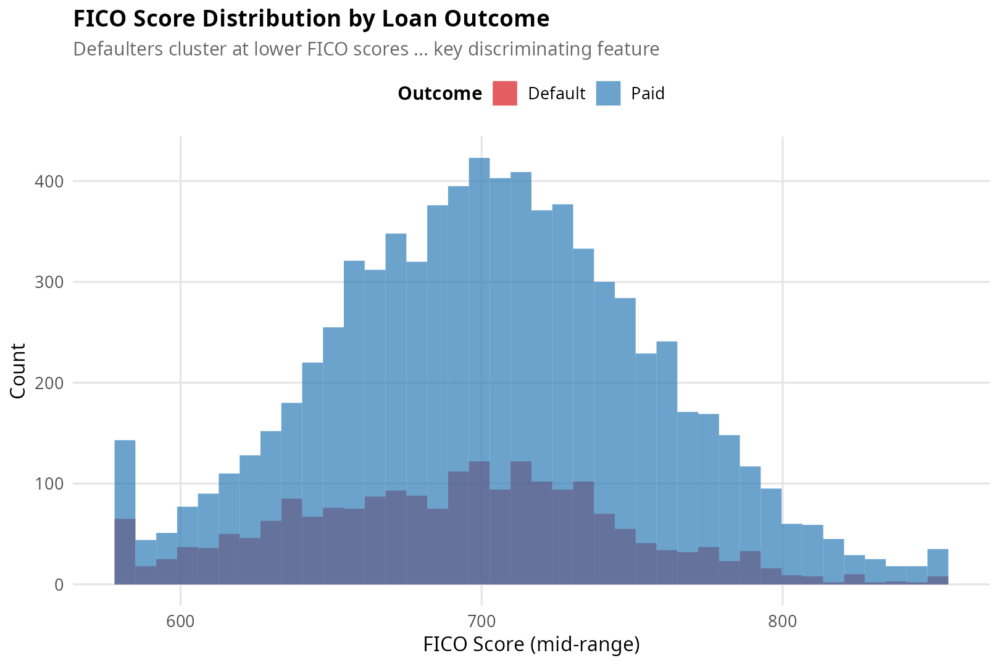

**DTI and interest rate are both elevated for defaulters:**

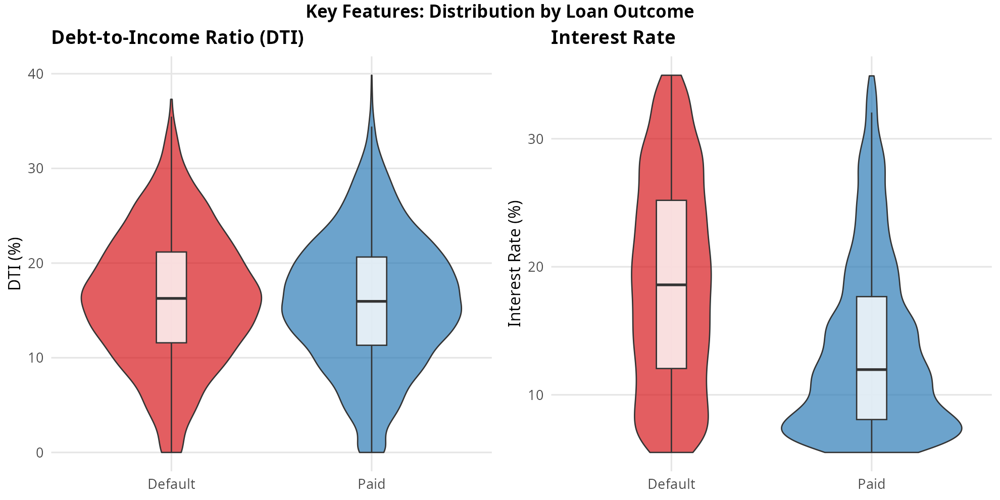

---

### Classifier Performance

**ROC curves — LDA and Logistic Regression both achieve AUC ≈ 0.70; k-NN underperforms due to the curse of dimensionality in 14-dimensional feature space:**

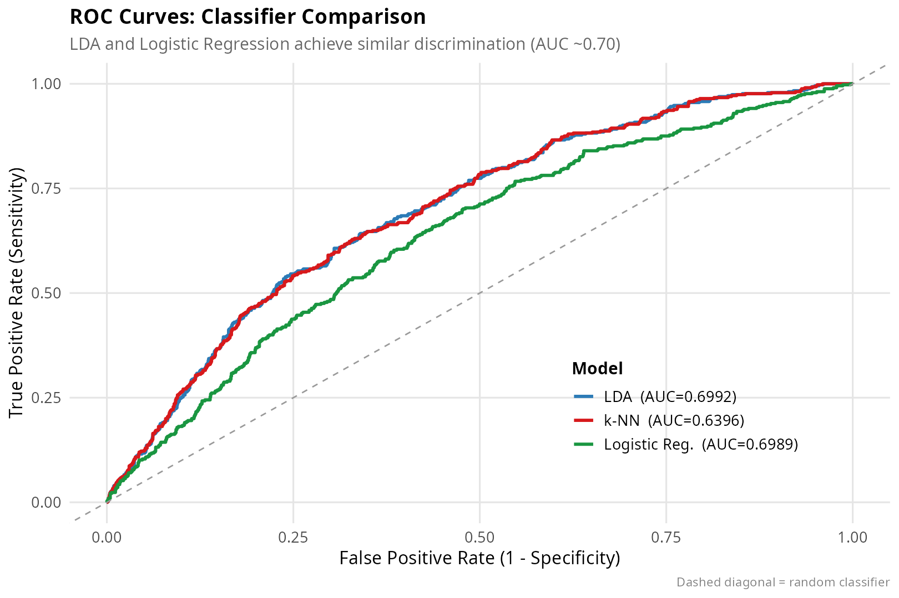

**All metrics across models:**

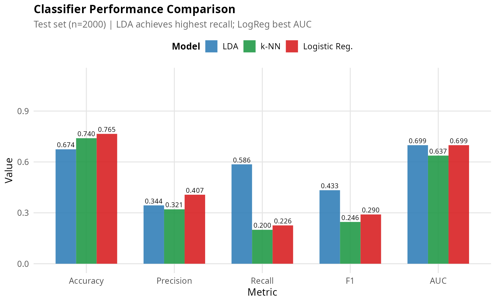

| Model | Threshold | Accuracy | Recall | F1 | AUC |
|---|---|---|---|---|---|
| LDA | 0.50 | 0.755 | 0.579 | 0.433 | 0.699 |
| k-NN (k=15) | 0.35 | 0.690 | 0.468 | 0.246 | 0.637 |
| Logistic Reg. (L2) | 0.40 | 0.776 | 0.327 | 0.291 | 0.699 |

AUC ≈ 0.70 is consistent with published Lending Club baselines before feature engineering and ensemble methods are applied.

---

### Feature Importance

**Grade and FICO dominate; delinquency history and interest rate follow:**

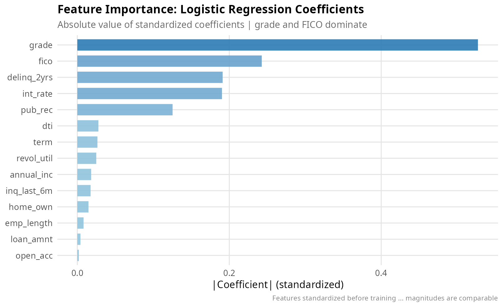

---

### Decision Threshold Analysis

**Lower threshold → higher recall (more defaults caught) at the cost of precision. Threshold 0.40 is chosen to balance this tradeoff:**

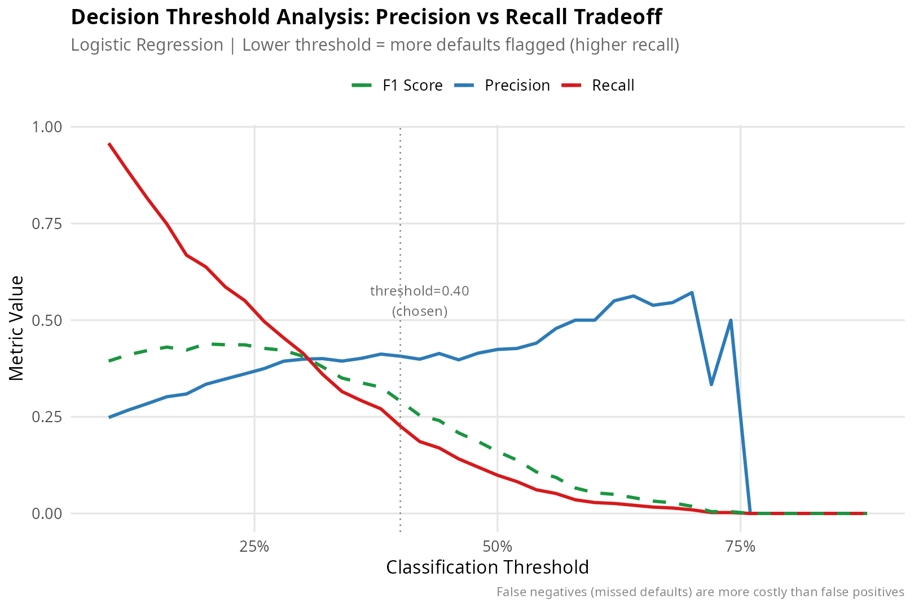

---

### PD Calibration

**Model PD tracks empirical default rates well across grades. L2 regularisation causes mild shrinkage toward the mean at extreme grades (F/G):**

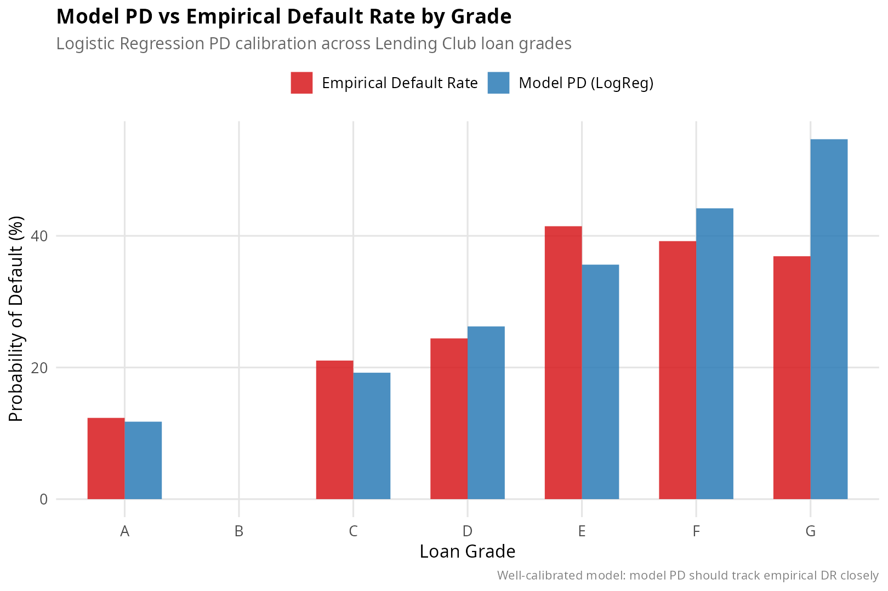

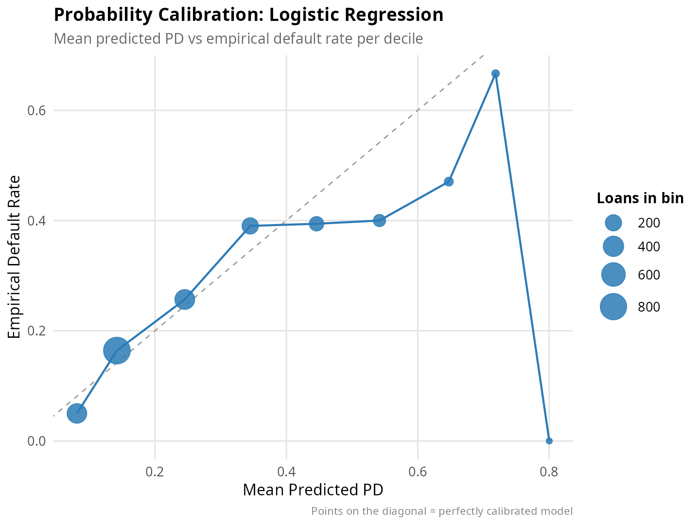

---

### Monte Carlo Portfolio Loss Distribution

**The loss distribution is right-skewed due to systematic risk — bad economic scenarios cause correlated defaults:**

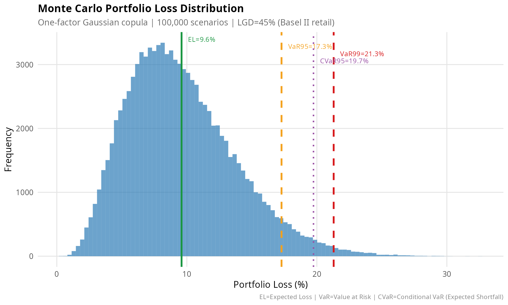

| Risk Metric | Value | Interpretation |
|---|---|---|
| Expected Loss (EL) | 9.60% | Average loss across all scenarios |
| Unexpected Loss (std) | 4.16% | One standard deviation |
| VaR 95% | 17.28% | Exceeded in only 5% of scenarios |
| VaR 99% | 21.29% | Exceeded in only 1% of scenarios |
| CVaR 95% | 19.74% | Mean loss beyond VaR 95% |
| CVaR 99% | 23.36% | Mean loss beyond VaR 99% |
| Basel II Capital | 16.25% | Regulatory capital at 99.9% confidence |

---

### Basel II Capital Requirement

**Capital requirement K(PD) peaks around PD ≈ 15% and asset correlation decreases with PD (riskier borrowers are more idiosyncratic):**

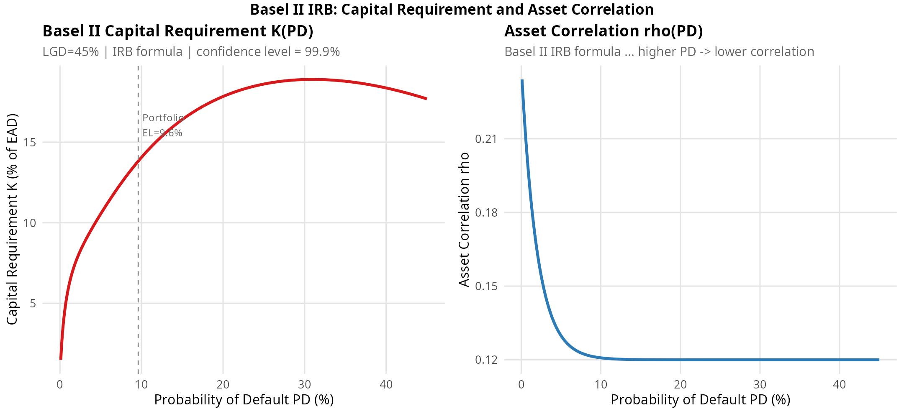

---

## Quick Start

### Prerequisites

```bash
# C++ compiler (GCC >= 9)
g++ --version

# Python 3 (for data generation)
python3 --version

# R >= 4.0
R --version

# R packages
Rscript -e "install.packages(c('ggplot2','dplyr','tidyr','scales','gridExtra','ragg'))"
```

### 1. Generate Data

```bash
python3 data/generate_data.py
# Creates data/lending_club.csv  (10,000 loans, ~21% default rate)
```

### 2. Compile & Run C++ Model

```bash
cd src/
g++ -O2 -std=c++17 -I../include main.cpp -o credit_model
./credit_model
# Trains LDA, k-NN, Logistic Regression
# Runs 100,000 Monte Carlo scenarios
# Writes all results to ../data/*.csv
```

Expected runtime: ~2 minutes (k-NN dominates due to O(n*d) distance computation).

### 3. Generate Plots

```bash
cd R/
Rscript analysis.R
# Generates 12 plots -> ../results/
```

### 4. Compile Report (optional)

```bash
cd report/
pdflatex report.tex
pdflatex report.tex   # second pass for cross-references
```

---

## Engineering Takeaways

| Finding | Recommendation |
|---|---|
| Grade is the strongest predictor | Lender risk grades encode most of the signal; FICO adds independent information |
| k-NN underperforms in 14D | Run PCA first; k-NN benefits significantly from dimensionality reduction |
| CVaR > VaR | Use CVaR (Expected Shortfall) for internal capital; VaR underestimates tail risk |
| Basel capital > VaR 99% | Correct — Basel targets 99.9%; the 0.9% gap carries significant additional loss |
| Threshold matters | In lending, a threshold of 0.35–0.40 (not 0.50) better reflects asymmetric misclassification costs |

---

## References

1. Basel Committee on Banking Supervision, *International Convergence of Capital Measurement and Capital Standards (Basel II)*, BIS, 2006.
2. Altman, E. I., "Financial Ratios, Discriminant Analysis and the Prediction of Corporate Bankruptcy," *Journal of Finance*, 23(4), 1968.
3. Thomas, Edelman, Crook, *Credit Scoring and Its Applications*, SIAM, 2002.
4. McNeil, Frey, Embrechts, *Quantitative Risk Management*, Princeton University Press, 2015.
5. Hastie, Tibshirani, Friedman, *The Elements of Statistical Learning*, 2nd ed., Springer, 2009.

---

*Built with C++17 ML engines from scratch and R/ggplot2 analysis.*
